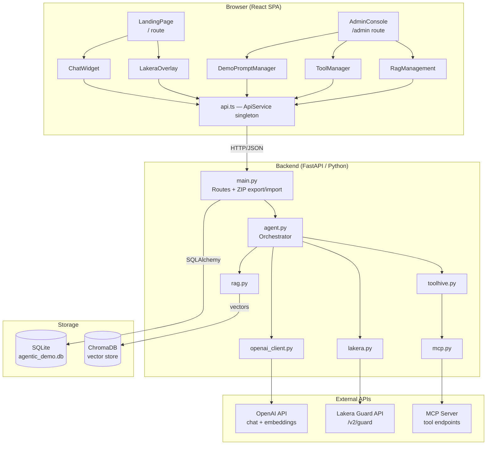
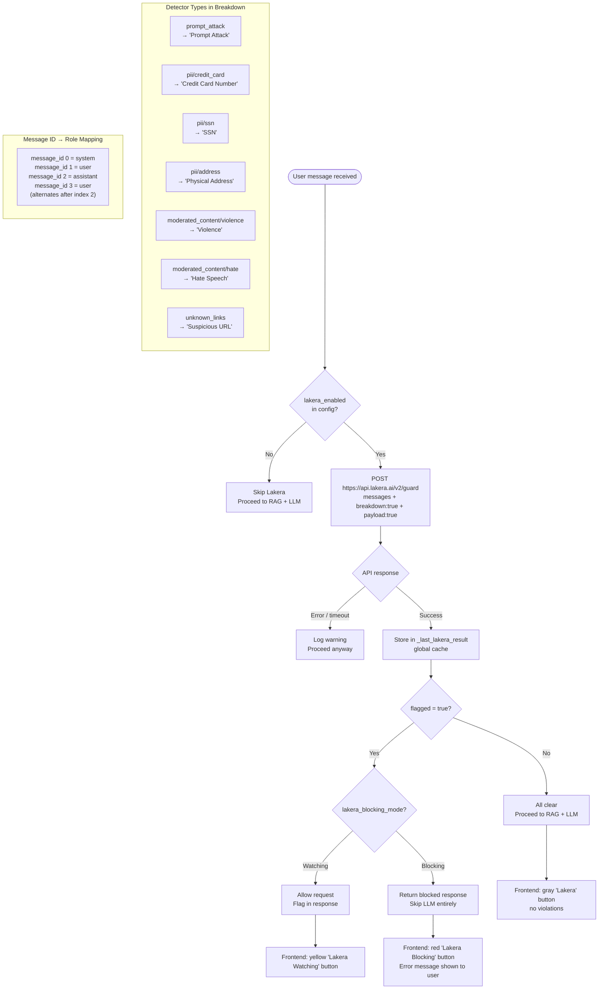
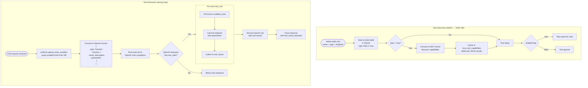
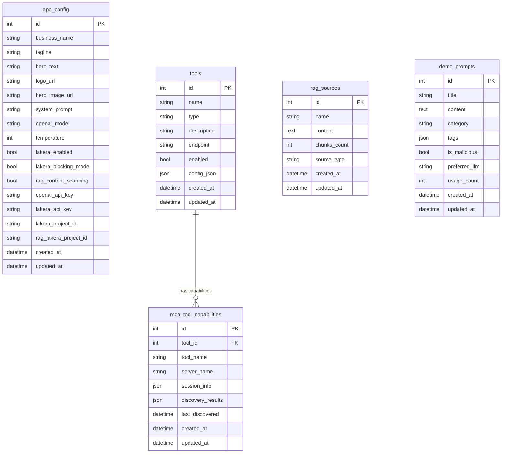

# Guard Demo Client — Workflow Diagrams

This document captures all major logic flows in the application using Mermaid diagrams.

---

## 1. System Architecture Overview

High-level view of all components, their layers, and how they connect.



---

## 2. Chat Message Flow

The primary user interaction — from typing a message to seeing the response.

```mermaid
sequenceDiagram
    actor User
    participant CW as ChatWidget (React)
    participant API as api.ts
    participant MAIN as main.py /api/chat
    participant AGENT as agent.py
    participant LAK as lakera.py
    participant RAG as rag.py
    participant TH as toolhive.py
    participant OAI as openai_client.py
    participant OPENAI as OpenAI API
    participant LAKERA as Lakera Guard API

    User->>CW: Types message (≥2 chars)
    CW->>API: GET /demo-prompts/search?q=...
    API-->>CW: Matching demo prompts (autocomplete)
    User->>CW: Presses Enter (or selects suggestion)

    CW->>API: POST /api/chat { message, session_id }
    API->>MAIN: ChatRequest

    MAIN->>AGENT: run_agent(message, config, db)

    %% Step 1: Lakera pre-check
    alt lakera_enabled = true
        AGENT->>LAK: check_interaction(messages)
        LAK->>LAKERA: POST /v2/guard { messages, breakdown:true }
        LAKERA-->>LAK: { flagged, breakdown, payload }
        LAK-->>AGENT: LakeraResult (stored in _last_lakera_result)

        alt flagged = true AND blocking_mode = true
            AGENT-->>MAIN: Blocked response
            MAIN-->>API: 200 { response: "blocked", lakera_result }
            API-->>CW: ChatResponse
            CW-->>User: Shows block message + red Lakera button
        end
    end

    %% Step 2: RAG retrieval
    AGENT->>RAG: retrieve(message, n_results=5)
    RAG->>OPENAI: POST /embeddings (query embedding)
    OPENAI-->>RAG: 1536-dim vector
    RAG->>RAG: ChromaDB cosine similarity search
    RAG-->>AGENT: top-k chunks + metadata (citations)

    %% Step 3: Tool manifest
    AGENT->>TH: openai_tools_manifest(db)
    TH-->>AGENT: [ OpenAI function definitions ]

    %% Step 4: LLM completion
    AGENT->>OAI: chat_completion(system_prompt + RAG_context + message + tools)
    OAI->>OPENAI: POST /chat/completions
    OPENAI-->>OAI: { content, tool_calls? }

    %% Step 5: Tool execution (if any)
    alt tool_calls present
        loop For each tool_call
            AGENT->>TH: execute_tool(name, args)
            TH-->>AGENT: tool result
        end
        AGENT->>OAI: chat_completion(+ tool results)
        OAI->>OPENAI: POST /chat/completions
        OPENAI-->>OAI: Final response
    end

    AGENT-->>MAIN: { response, lakera_result, tool_traces, citations }
    MAIN-->>API: ChatResponse JSON
    API-->>CW: ChatResponse
    CW-->>User: Renders message + optional Lakera button

    opt User clicks Lakera button
        User->>CW: Click "Lakera Blocking/Watching"
        CW->>API: GET /api/lakera/last
        API-->>CW: Cached LakeraResult
        CW->>LO: Open LakeraOverlay(result)
        LO-->>User: Modal: TL;DR + breakdown + raw JSON
    end
```

---

## 3. Lakera Guard Security Flow

Detailed view of the guardrail decision logic and what gets surfaced in the UI.



---

## 4. RAG Pipeline

How knowledge is ingested, stored, and retrieved at chat time.

```mermaid
flowchart TD
    subgraph Ingestion["Ingestion (Admin → RAG Tab)"]
        UP([File Upload\nPDF / MD / TXT / CSV]) --> PARSE
        GEN([AI Generate\nindustry + seed prompt]) --> GENAI[OpenAI generates\nmarkdown content]
        GENAI --> SCAN{rag_content_scanning\nenabled?}
        SCAN -- Yes --> LAKSCAN[Lakera Guard check\non generated content]
        SCAN -- No --> PARSE
        LAKSCAN --> PARSE

        PARSE[Parse file to plain text\npypdf2 / markdown / pandas] --> CHUNK
        CHUNK["Chunk text\n800 chars, 200 char overlap"] --> EMBED
        EMBED[OpenAI text-embedding-ada-002\n→ 1536-dim vector per chunk] --> STORE
        STORE[ChromaDB upsert\ncollection: agentic_demo] --> META
        META[Record RagSource\nin SQLite\nname + content + chunks_count]
    end

    subgraph Retrieval["Retrieval (at chat time)"]
        QUERY([User message]) --> QEMBED[Embed query\nOpenAI embeddings]
        QEMBED --> SEARCH[ChromaDB cosine similarity\ntop-k chunks]
        SEARCH --> THRESH{score ≥ threshold?}
        THRESH -- Yes --> INJECT[Inject chunks as\nsystem context in OpenAI request]
        THRESH -- No --> NOCTX[No RAG context added]
        INJECT --> CITE[Return citations\nin ChatResponse]
    end

    subgraph ChunkMetadata["ChromaDB Entry Structure"]
        CM["id: unique_id\nembedding: [1536 floats]\ndocument: 800-char text chunk\nmetadata:\n  source: filename or 'generated'\n  chunk_index: N\n  total_chunks: N"]
    end
```



---

## 5. Tool / MCP Integration Flow

How tools are discovered, registered, and executed during chat.



---

## 6. Admin Configuration & Export/Import Flow

How the admin console manages config and shares it via ZIP.

```mermaid
flowchart TD
    subgraph AdminTabs["AdminConsole Tabs"]
        T1[Setup]
        T2[Branding\nbusiness_name, tagline,\nlogo_url, hero_image_url]
        T3[LLM\nmodel, temperature 0-10,\nsystem_prompt]
        T4[RAG\nupload / generate sources]
        T5[Tools\nHTTP + MCP tools]
        T6[Security\nOpenAI key, Lakera key,\nenabled + blocking_mode]
        T7[Prompts\ndemo prompt library\nCRUD + malicious flag]
        T8[Export / Import]
    end

    subgraph ConfigUpdate["Config Update Flow"]
        CHANGE([Form field changes]) --> DEBOUND[Debounced handler\n~300ms]
        DEBOUND --> PUT[PUT /api/config\nAppConfigUpdate]
        PUT --> SQLITE[SQLite UPDATE\napp_config row]
        SQLITE --> TOAST[Success toast\nnotification]
    end

    subgraph ExportFlow["Export Flow"]
        EXP([Admin clicks Export]) --> SELECT[Select sections:\nappearance / llm / security /\napi_keys / project_ids /\ntools / rag / demo_prompts]
        SELECT --> ZIP_BUILD[Build ZIP in memory]
        ZIP_BUILD --> META[metadata.json\nversion:2.0 + included sections]
        ZIP_BUILD --> CFG[config.json\nselected config fields]
        ZIP_BUILD --> DP[demo_prompts.json\nif included]
        ZIP_BUILD --> TLS[tools.json\nif included]
        ZIP_BUILD --> CHROMA_DIR[data/chroma/\nvector store files\nif rag included]
        META & CFG & DP & TLS & CHROMA_DIR --> DOWNLOAD([ZIP download])
    end

    subgraph ImportFlow["Import Flow"]
        IMP([Admin uploads ZIP]) --> READ_META[Read metadata.json\ndetect version]
        READ_META --> V{version?}
        V -- 2.0 --> SECTIONS[Read included_sections\nfrom metadata]
        V -- 1.0 legacy --> ALL[Treat all sections\nas included]
        SECTIONS & ALL --> MERGE[Merge-based import:\nonly overwrite sections\npresent in ZIP]
        MERGE --> APPLY_CFG[Apply config fields\nto SQLite]
        MERGE --> APPLY_DP[Insert/update\ndemo_prompts]
        MERGE --> APPLY_TLS[Insert/update\ntools]
        MERGE --> APPLY_CHROMA[Restore ChromaDB\nvectors if present]
    end

    subgraph TemperatureConversion["Temperature Scale Conversion"]
        TC["Admin UI / SQLite: 0–10 integer\n         ÷ 10\nOpenAI API: 0.0–1.0 float"]
    end
```



---

## 7. Data Model Overview

How the database tables relate to each other and to the services.


